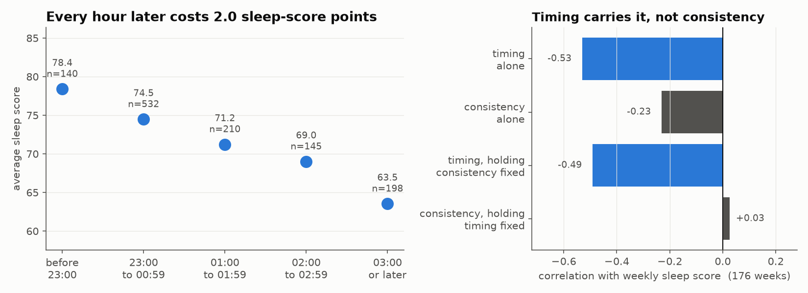
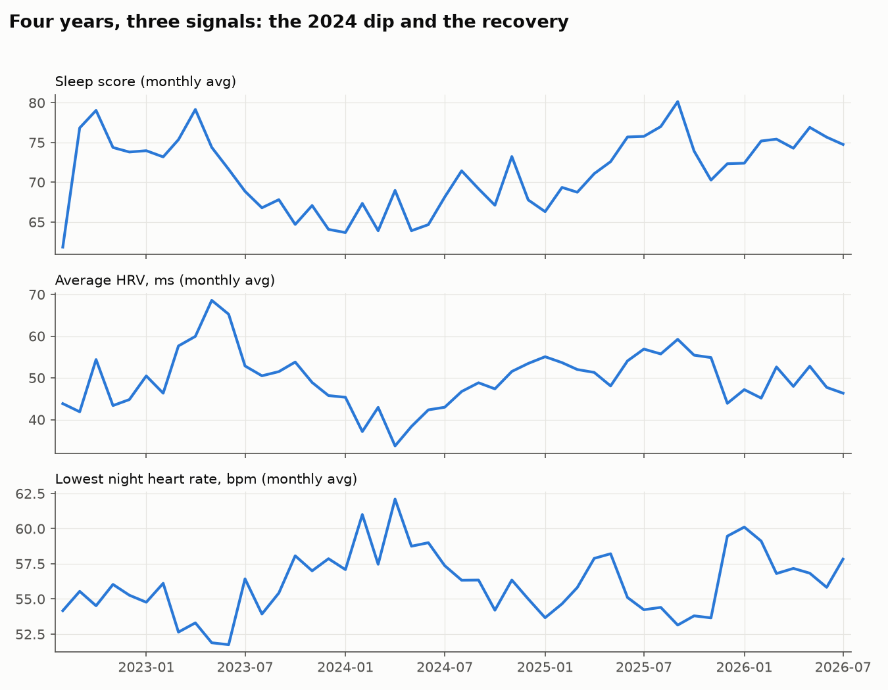
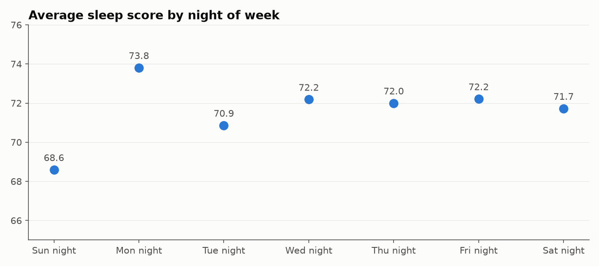
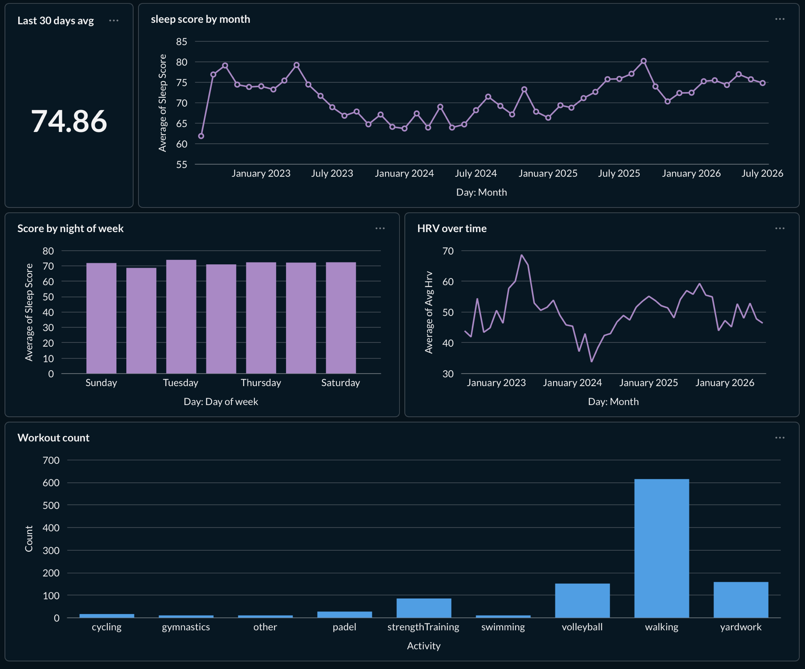

# Oura Data Pipeline

[](https://github.com/masixz/oura-data-pipeline/actions/workflows/ci.yml)

Four years of my own Oura Ring data: pulled through the Oura API v2 (OAuth2),
loaded into PostgreSQL, analyzed with SQL and Python.

**1,244 nights. 2,238 sleep periods. 1,106 workouts.**

## Why

I have worn an Oura ring daily since 2022 and check the stats every morning.
This project turns that habit into a data pipeline: my own sleep, readiness,
activity, heart rate, and stress data, end to end.

## The headline finding



I first assumed bedtime *consistency* was what mattered. Tested on 176 weeks
of data: consistency is nearly irrelevant for me (r = -0.12, n.s.) - *timing*
dominates (r = -0.42, p < 1e-8). Every hour of later bedtime costs ~2.7
sleep-score points; a night starting after 01:00 averages 13.4 points below
one starting at 20-21, which equals the quality effect of ~2.7 fewer hours
of sleep.

## Findings so far



**The 2024 dip is real and physiological.** Sleep score, HRV, and night
heart rate degraded together from late 2023 and bottomed out in spring 2024,
with large effects winter on winter: HRV -10 ms (d = 0.87), night heart rate
+4.6 bpm (d = 1.02), sleep score -9.4 points (d = 0.84). All three recovered
through 2025. Rolling HRV stayed below -1.5 sigma of its own distribution from
10 April to 3 June, bottoming at -2.6 sigma; that 44-day span says how long
the excursion lasted, not how strong the evidence is.
Full statistics in [notebooks/01_sleep_statistics.ipynb](notebooks/01_sleep_statistics.ipynb),
including the Welch t-tests and the falsified late-bedtime hypothesis behind
the Sunday-night effect.



**Sunday night is reliably my worst sleep** (average score 68.6 vs 73.8 for
Monday night) across four years of data. Oura assigns each sleep to the
wake-up day, so this is the classic Sunday-night effect, visible in n=173
Sunday nights rather than anecdote. Tested by permuting days inside each week,
which keeps seasonal drift out of the comparison: 3.4 points below the week
average, p = 0.0007, 95% CI 1.3 to 5.5 points.

**Why is my REM low? Not for the reasons I assumed.** Nine hypotheses tested
in assumption -> check -> visualisation format
([notebooks/03_rem_investigation.ipynb](notebooks/03_rem_investigation.ipynb)):
stress, workouts, and late bedtimes all came back clean, and at ~1,000 nights
each those nulls are strong enough to rule out anything above r = 0.09. The
only strong lever is duration (r = 0.80, ~15 min REM per extra hour of
sleep), with the morning end carrying a disproportionate REM share. My REM
is not damaged - it is starved of an 8th hour of sleep.

**Two findings did not survive their own robustness check.** A multi-year REM
decline and a weekend REM effect were both reported as significant on
p-values that assumed independent nights. Re-tested properly, the REM decline
is better explained as a measurement step change at an Oura algorithm update,
and the weekend effect is inconclusive. Both are withdrawn, with the working
shown in
[notebooks/04_statistical_robustness.ipynb](notebooks/04_statistical_robustness.ipynb):
effect sizes, autocorrelation-aware p-values, minimum detectable effects for
every null, and a Benjamini-Hochberg pass over the whole inventory.

**Can tonight's sleep be predicted before bed?** Partly: a random forest on
pre-bed features (bedtime, day of week, recent history, day's activity) beats
the naive baselines by ~13% (MAE 7.9 vs 9.1) on a time-based test split.
Bedtime is the biggest controllable lever. Full modeling with baselines and
honest evaluation in
[notebooks/02_sleep_forecasting.ipynb](notebooks/02_sleep_forecasting.ipynb).

## Privacy

The code is public. The data is not.

- Raw health data never enters this repo (see `.gitignore`)
- Published analysis contains aggregated statistics and charts only
- See [PRIVACY.md](PRIVACY.md)

## Dashboard

Built in Metabase (runs in the same docker compose) on top of the dbt staging
layer:



## Architecture

```
Oura API v2 (OAuth2) -> Python ingestion -> PostgreSQL (Docker)
                                              raw (JSONB) -> dbt staging models -> notebooks + charts
```

- `ingestion/` — OAuth2 flow + idempotent API ingestion (upsert on document id; re-runs never duplicate), covered by pytest
- `dbt_project/` — staging layer as dbt models: typed views over raw JSONB, with schema tests (unique, not_null, score ranges)
- `notebooks/` — statistics (01), forecasting (02), REM investigation (03) and robustness testing (04), executed with outputs
- `analysis/` — README chart generation plus `statistics.py`, the inference helpers behind notebook 04 (effective sample size, block bootstrap, within-week contrasts, FDR)
- `.github/workflows/ci.yml` — every push to main and every pull request runs the test suite and `dbt build` against a Postgres service container, seeded with synthetic fixtures in `tests/fixtures/` so the schema tests check the JSONB extraction instead of passing against an empty table

```bash
make refresh   # ingest -> dbt build -> charts
make test      # pytest
```

## Setup

```bash
# 1. Start the database
docker compose up -d

# 2. Python environment
python3 -m venv .venv && source .venv/bin/activate
pip install -r requirements.txt

# 3. Credentials: copy the template, fill in your Oura OAuth app values
cp .env.example .env

# 4. One-time OAuth authorization (opens your browser)
python -m ingestion.auth

# 5. Pull your data, build the staging layer
make refresh
```
